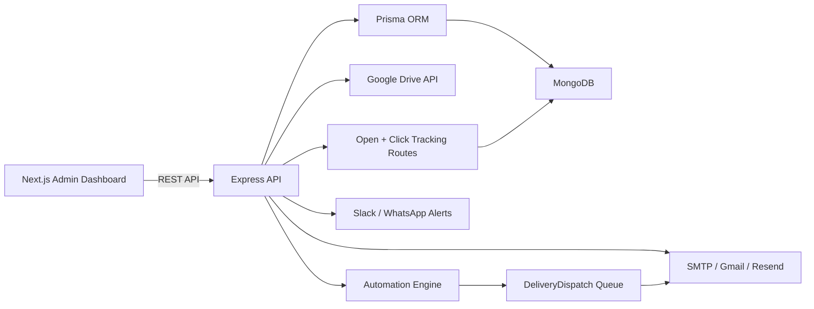

# E-commerce Photography Studio Automation

This implementation turns the repository into an event-driven delivery platform for photo studios that need to send polished client delivery emails with Google Drive links and track the outcome end to end.

## Architecture



## Trigger Logic

Delivery is only queued when:

1. `status === COMPLETED`
2. `requiresFollowUp === false` or `followUpSentAt` exists
3. `deliveryEmailSent === false`
4. A Google Drive link exists

The system is event-driven on create/update and also runs a reconciliation loop to catch missed state changes.

## Backend API Structure

### Studio dashboard endpoints

- `GET /api/studio/overview`
- `GET /api/studio/clients`
- `POST /api/studio/clients`
- `PATCH /api/studio/clients/:id`
- `DELETE /api/studio/clients/:id`
- `GET /api/studio/projects?status=&clientId=&deliverySent=&search=`
- `POST /api/studio/projects`
- `PATCH /api/studio/projects/:id`
- `POST /api/studio/projects/:id/manual-send`
- `POST /api/studio/projects/:id/extend-deadline`
- `POST /api/studio/projects/:id/notes`
- `GET /api/studio/templates/preview?projectId=&tone=`
- `GET /api/studio/logs`
- `POST /api/studio/automation/reconcile`
- `POST /api/studio/automation/process`

### Tracking endpoints

- `GET /api/studio/tracking/open/:token`
- `GET /api/studio/tracking/click/:token`

## Database Schema

### Core models

- `StudioClient`
  - client identity, brand info, studio notes, contact email
- `StudioProject`
  - project code, status, follow-up state, Google Drive metadata, delivery state, deadline, notes
- `DeliveryDispatch`
  - durable queue record, retry counters, next attempt timestamp, lock ownership, failure reason
- `DeliveryEmailLog`
  - rendered subject/html/text snapshot, provider metadata, tracking tokens, open/click timestamps
- `StudioProjectActivity`
  - audit trail for notes, status changes, follow-up completion, queueing, sending, and failures

### Reliability patterns

- Unique dispatch per project prevents accidental duplicate automation jobs
- Delivery flags on the project prevent repeat automatic sends
- Tracking tokens are unique per email log
- Retry metadata is persisted in MongoDB, so restarts do not lose queue state

## Email Templates

### Formal

Subject example:

`Acme Apparel delivery package is ready | APR-ACME-001`

### Friendly

Subject example:

`Your Acme Apparel photos are ready (APR-ACME-001)`

### Premium Client Tone

Subject example:

`Acme Apparel final delivery is curated and ready | APR-ACME-001`

Each template includes:

- Personalized greeting with client name
- Brand-aware copy
- Google Drive CTA button
- Revision request CTA
- Feedback CTA
- Open pixel and tracked Drive link

## Queue and Retry Design

- Eligible projects are upserted into `DeliveryDispatch`
- Worker claims a dispatch with a time-based lock
- Email failures move the dispatch to `RETRYABLE`
- Backoff doubles from `STUDIO_DELIVERY_RETRY_BASE_MS`
- Final failures move the dispatch to `FAILED`
- Slack or WhatsApp notifications fire on failure

## Google Drive Validation

The system validates:

- folder id extraction from the Drive URL
- file/folder existence when `GOOGLE_DRIVE_ACCESS_TOKEN` is configured
- public view sharing through Drive permissions

When the Drive API token is absent, the system still validates URL format and records the sharing state as `UNKNOWN`.

## Frontend Dashboard

The dashboard lives in [`apps/dashboard`](/C:/Users/Sanjay%20Mishra/Documents/New%20project/apps/dashboard) and provides:

- overview cards for delivery health
- project list with delivery status and follow-up state
- manual send and edit panel
- log history panel
- live API fetch with demo-data fallback for isolated UI work

## Deployment

### Docker

1. Copy `.env.example` to `.env`
2. Set `DATABASE_URL`, SMTP or Resend settings, Google Drive token, and alert webhooks
3. Run:

```bash
docker compose up --build
```

Services:

- API on `http://localhost:4000`
- Dashboard on `http://localhost:3000`
- MongoDB on `mongodb://localhost:27017`

### CI/CD

GitHub Actions workflow:

- installs backend dependencies
- generates Prisma client
- runs Jest tests
- installs dashboard dependencies
- builds the Next.js dashboard

File:

- [ci.yml](/C:/Users/Sanjay%20Mishra/Documents/New%20project/.github/workflows/ci.yml)

## Security Notes

- OAuth and delivery credentials are environment-based
- rate limiting, Helmet, and auth middleware remain enabled
- delivery tracking tokens are opaque random values
- no secret values are committed into code

## Recommended Next Production Steps

1. Run `npx prisma db push` against the target MongoDB instance.
2. Configure a service account or OAuth token for Google Drive validation.
3. Connect dashboard auth to the existing JWT login flow.
4. Replace demo dashboard fetches with authenticated requests from session context.
5. Add a dedicated background worker process if you want to scale API and automation independently.
